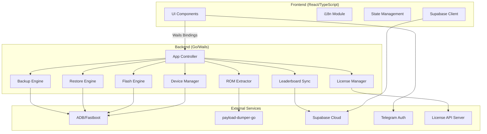
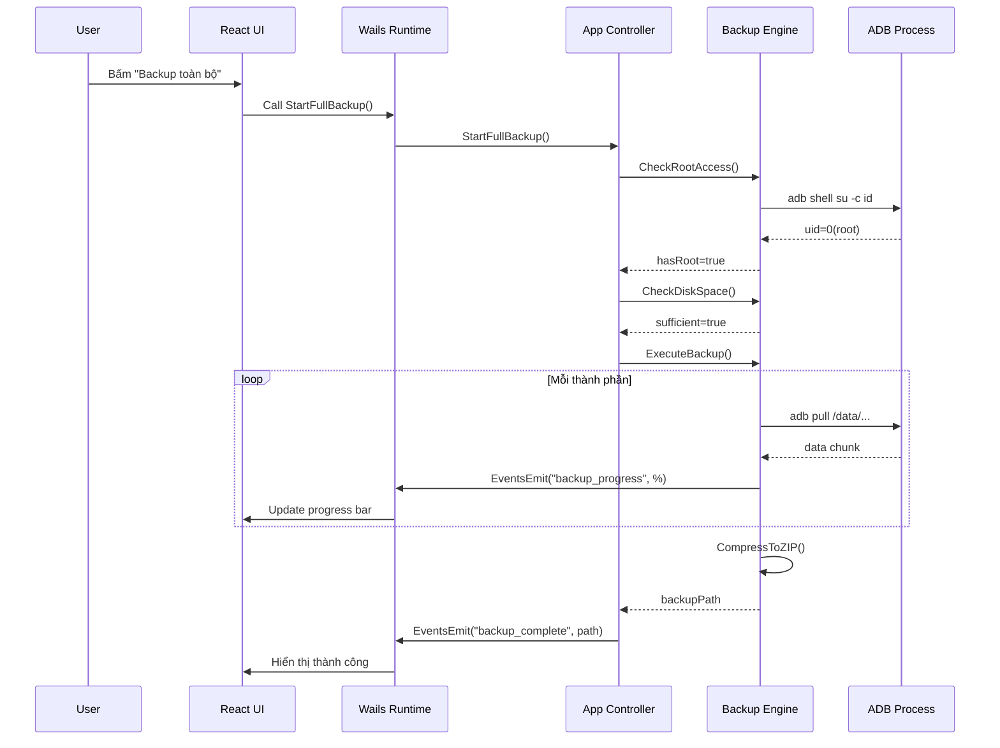

# Tài liệu Thiết kế — FlashFlow v2 Upgrade

## Tổng quan (Overview)

FlashFlow v2 là bản nâng cấp toàn diện cho ứng dụng desktop flash ROM Android, xây dựng trên nền tảng Go backend + React/TypeScript frontend sử dụng Wails framework. Phiên bản này bổ sung 8 nhóm tính năng chính:

1. **Backup/Restore toàn bộ dữ liệu** (yêu cầu root) — cho phép thợ sửa điện thoại sao lưu và khôi phục dữ liệu khách hàng một chạm
2. **Quản lý bản backup** — giao diện quản lý, xóa, theo dõi dung lượng các bản backup
3. **Leaderboard cải tiến** — chỉ còn 2 tab (Vua Flash + Cú Đêm), dữ liệu thật từ Supabase
4. **Flash Engine bug fixes** — sửa lỗi stability delay, findFirstMatch, stop-on-error, cancel logic
5. **UX/UI improvements** — theme switching, i18n, copy log, loading states, brand persistence
6. **ROM Extractor** — trích xuất file .img riêng lẻ từ ROM ZIP hoặc payload.bin
7. **License & Security** — cache offline 24h, graceful expiry mid-flash, config bảo mật

**Phạm vi:** Chỉ hỗ trợ OnePlus. Pixel và Xiaomi giữ trạng thái "Coming Soon".

---

## Kiến trúc (Architecture)

### High-Level Architecture



### Low-Level Module Interaction



---

## Components và Interfaces

### 1. Backup Engine (`backup_engine.go`)

```go
// BackupConfig chứa cấu hình cho một phiên backup
type BackupConfig struct {
    DeviceSerial string
    OutputDir    string
    Components   []BackupComponent
}

type BackupComponent struct {
    Name     string // "contacts", "sms", "app_data", "media", "settings"
    Source   string // Đường dẫn trên thiết bị
    Priority int    // Thứ tự backup
}

type BackupResult struct {
    FilePath       string
    TotalSize      int64
    Components     []ComponentResult
    StartedAt      time.Time
    CompletedAt    time.Time
    Checksum       string // SHA-256
    FormatVersion  int    // Phiên bản format backup
}

type ComponentResult struct {
    Name    string
    Size    int64
    Status  string // "success", "failed", "partial"
    Error   string
}

// Interface chính
func (a *App) StartFullBackup() error
func (a *App) CheckRootAccess() (bool, error)
func (a *App) GetBackupEstimatedSize() (int64, error)
func (a *App) CancelBackup()
```

### 2. Restore Engine (`restore_engine.go`)

```go
type RestoreConfig struct {
    BackupPath   string
    DeviceSerial string
    Components   []string // Danh sách component cần restore
}

type RestoreResult struct {
    AppsRestored  int
    DataSize      int64
    Duration      time.Duration
    Components    []ComponentResult
}

// Interface chính
func (a *App) StartRestore(backupPath string) error
func (a *App) ValidateBackup(backupPath string) (BackupMetadata, error)
func (a *App) CancelRestore()
```

### 3. Backup Manager (Frontend)

```typescript
interface BackupItem {
    id: string;
    deviceName: string;
    createdAt: string;       // ISO 8601
    size: number;            // bytes
    status: 'complete' | 'incomplete';
    checksum: string;
    formatVersion: number;
    components: string[];
}

interface BackupManagerProps {
    backups: BackupItem[];
    totalSize: number;
    diskFreeSpace: number;
    onDelete: (id: string) => void;
    onRestore: (id: string) => void;
    onCreateNew: () => void;
}
```

### 4. Leaderboard Service (Cải tiến)

```typescript
// Chỉ còn 2 tab
type LeaderboardTab = 'vua_flash' | 'cu_dem';

interface LeaderboardEntry {
    rank: number;
    telegramId: number;
    name: string;
    avatarUrl: string;
    score: number;
    badge: string;
}

interface FlashRecord {
    telegramId: number;
    deviceName: string;
    romName: string;
    timestamp: string;      // UTC+7
    isNightFlash: boolean;  // 01:00-04:00 UTC+7
}

// Offline queue
interface OfflineQueue {
    records: FlashRecord[];
    maxSize: 50;
    retryOnReconnect: boolean;
}
```

### 5. ROM Extractor (`rom_extractor.go`)

```go
type PartitionInfo struct {
    Name string `json:"name"`
    Size int64  `json:"size"`
    Type string `json:"type"` // "img", "bin", "other"
}

type ExtractRequest struct {
    RomPath    string   `json:"romPath"`
    Partitions []string `json:"partitions"` // Tên partition cần extract
    OutputDir  string   `json:"outputDir"`
}

type ExtractProgress struct {
    Current    string  `json:"current"`    // Partition đang extract
    Percent    int     `json:"percent"`
    TotalFiles int     `json:"totalFiles"`
    DoneFiles  int     `json:"doneFiles"`
}

// Interface chính
func (a *App) ListRomPartitions(romPath string) ([]PartitionInfo, error)
func (a *App) ExtractPartitions(req ExtractRequest) error
func (a *App) CancelExtract()
func (a *App) CopyFromCache(romId string, partitions []string, outputDir string) error
```

### 6. License Manager (Cải tiến)

```go
type LicenseCacheEntry struct {
    Response    LicenseResponse `json:"response"`
    CheckedAt   int64           `json:"checkedAt"`   // Unix timestamp
    ExpiresAt   int64           `json:"expiresAt"`   // checkedAt + 24h
}

// Hàm mới
func (a *App) GetCachedLicense() (*LicenseCacheEntry, error)
func (a *App) SaveLicenseCache(resp LicenseResponse) error
func (a *App) IsLicenseCacheValid() bool
func (a *App) IsLicenseValidForFlash() bool // Kết hợp cache + online check
```

### 7. i18n Module (Frontend)

```typescript
type Locale = 'vi' | 'en';

interface I18nConfig {
    currentLocale: Locale;
    fallbackLocale: Locale; // 'vi'
    translations: Record<Locale, Record<string, string>>;
}

// Hàm translate với fallback
function t(key: string): string {
    const value = translations[currentLocale][key];
    if (value) return value;
    // Fallback: trả về key gốc, KHÔNG trả về chuỗi rỗng
    return key;
}
```

---

## Data Models

### Supabase Schema

#### Bảng `users` (đã có, cần bổ sung)

| Column | Type | Description |
|--------|------|-------------|
| id | uuid | Primary key |
| telegram_id | bigint | Telegram user ID |
| full_name | text | Tên hiển thị |
| avatar_url | text | URL avatar |
| total_flashes | int | Tổng số lần flash thành công |
| night_flashes | int | **MỚI** - Số lần flash trong khung 01:00-04:00 UTC+7 |
| created_at | timestamptz | Ngày tạo |
| updated_at | timestamptz | Ngày cập nhật |

#### Bảng `flash_records` (MỚI)

| Column | Type | Description |
|--------|------|-------------|
| id | uuid | Primary key |
| telegram_id | bigint | FK → users.telegram_id |
| device_name | text | Tên thiết bị |
| rom_name | text | Tên ROM đã flash |
| flashed_at | timestamptz | Thời điểm flash (UTC+7) |
| is_night | boolean | Flash trong khung 01:00-04:00 |
| created_at | timestamptz | Auto |

### Backup Metadata Format (JSON trong ZIP)

```json
{
    "formatVersion": 1,
    "appVersion": "2.0.0",
    "deviceName": "OnePlus 12",
    "deviceSerial": "ABC123",
    "createdAt": "2024-01-15T10:30:00+07:00",
    "checksum": "sha256:abc123...",
    "components": [
        {
            "name": "contacts",
            "path": "contacts/",
            "size": 1048576,
            "status": "complete"
        },
        {
            "name": "app_data",
            "path": "app_data/",
            "size": 5368709120,
            "status": "complete"
        }
    ],
    "totalSize": 6442450944
}
```

### License Cache Format (Local Storage)

```json
{
    "response": {
        "result": "ACTIVE",
        "type": "PRO",
        "days_left": 180,
        "expiry_ts": 1720000000,
        "isPro": true
    },
    "checkedAt": 1710000000,
    "expiresAt": 1710086400
}
```

### Offline Flash Record Queue (Local Storage)

```json
{
    "queue": [
        {
            "telegramId": 123456789,
            "deviceName": "OnePlus 12",
            "romName": "OxygenOS_15.zip",
            "timestamp": "2024-01-15T02:30:00+07:00",
            "isNightFlash": true
        }
    ],
    "maxSize": 50,
    "lastSyncAttempt": "2024-01-15T10:00:00+07:00"
}
```

---

## Correctness Properties

*Một property là một đặc tính hoặc hành vi phải đúng trong mọi trường hợp thực thi hợp lệ của hệ thống — về bản chất là một phát biểu hình thức về những gì hệ thống phải làm. Properties đóng vai trò cầu nối giữa đặc tả dễ đọc và đảm bảo tính đúng đắn có thể kiểm chứng bằng máy.*

### Property 1: Kiểm tra dung lượng đĩa (Space Sufficiency)

*Cho bất kỳ* cặp giá trị (freeSpace, dataSize) với freeSpace > 0 và dataSize > 0, hàm kiểm tra dung lượng backup SHALL trả về `true` khi và chỉ khi freeSpace >= 1.5 * dataSize; tương tự cho restore, hàm SHALL trả về `true` khi và chỉ khi deviceFreeSpace >= backupSize.

**Validates: Requirements 1.4, 2.5**

### Property 2: Định dạng tên file backup (Round-trip)

*Cho bất kỳ* tên thiết bị hợp lệ (không chứa ký tự đặc biệt hệ thống file) và bất kỳ timestamp hợp lệ, việc tạo tên file backup theo format `{deviceName}_{YYYYMMDD}_{HHmmss}.zip` rồi parse ngược lại SHALL cho ra đúng deviceName và timestamp ban đầu.

**Validates: Requirements 1.6**

### Property 3: Xác minh tính toàn vẹn checksum

*Cho bất kỳ* mảng byte data, việc tính checksum SHA-256 rồi verify SHALL luôn pass. Nếu bất kỳ byte nào trong data bị thay đổi, verify SHALL fail.

**Validates: Requirements 2.3**

### Property 4: Thứ tự khôi phục dữ liệu

*Cho bất kỳ* bản backup chứa nhiều thành phần, thứ tự thực thi restore SHALL luôn là: cài đặt hệ thống → ứng dụng → dữ liệu ứng dụng → media, bất kể thứ tự lưu trữ trong file backup.

**Validates: Requirements 2.6**

### Property 5: Sắp xếp danh sách backup

*Cho bất kỳ* danh sách bản backup với các ngày tạo khác nhau, kết quả hiển thị SHALL luôn được sắp xếp theo ngày tạo giảm dần (mới nhất lên đầu).

**Validates: Requirements 3.1**

### Property 6: Phân loại timestamp "Cú Đêm"

*Cho bất kỳ* timestamp UTC, việc chuyển đổi sang UTC+7 và phân loại vào khung "Cú Đêm" SHALL trả về `true` khi và chỉ khi giờ (hour) thuộc khoảng [1, 4) (tức 01:00 AM đến 03:59 AM UTC+7).

**Validates: Requirements 4.4**

### Property 7: Tính toán vị trí xếp hạng

*Cho bất kỳ* danh sách users với điểm số (total_flashes hoặc night_flashes), vị trí xếp hạng của một user cụ thể SHALL bằng 1 + số users có điểm cao hơn user đó.

**Validates: Requirements 4.6**

### Property 8: Hàng đợi offline có giới hạn

*Cho bất kỳ* chuỗi flash records được thêm vào offline queue, kích thước queue SHALL không bao giờ vượt quá 50. Khi queue đầy và có record mới, record cũ nhất SHALL bị loại bỏ.

**Validates: Requirements 4.7**

### Property 9: Flash Report chứa đầy đủ thông tin

*Cho bất kỳ* phiên flash (thành công hoặc thất bại), Flash Report được tạo SHALL chứa tất cả các trường bắt buộc: thời gian bắt đầu, thời gian kết thúc, danh sách partition đã flash, danh sách lỗi (nếu có), tên ROM, tên thiết bị, và trạng thái cuối cùng.

**Validates: Requirements 5.4**

### Property 10: findFirstMatch trả về kết quả đúng

*Cho bất kỳ* cây thư mục và pattern, hàm `findFirstMatch` SHALL trả về đường dẫn đầu tiên (theo thứ tự WalkDir) khớp với pattern, hoặc chuỗi rỗng nếu không có file nào khớp. Hàm chỉ sử dụng một lần WalkDir duy nhất.

**Validates: Requirements 5.7**

### Property 11: Dừng chuỗi flash khi gặp lỗi

*Cho bất kỳ* danh sách partitions cần flash, nếu partition thứ N gặp lỗi, KHÔNG partition nào có index > N SHALL được flash. Số partition đã flash thành công SHALL bằng đúng N-1.

**Validates: Requirements 5.8**

### Property 12: i18n fallback không bao giờ trả về chuỗi rỗng

*Cho bất kỳ* translation key và locale, hàm `t(key)` SHALL trả về bản dịch nếu tồn tại, hoặc trả về chính key gốc nếu không có bản dịch. Kết quả KHÔNG BAO GIỜ là chuỗi rỗng.

**Validates: Requirements 6.5**

### Property 13: Liệt kê partition từ ROM ZIP

*Cho bất kỳ* file ZIP hợp lệ chứa các file .img, hàm `ListRomPartitions` SHALL trả về danh sách có số lượng bằng đúng số file .img trong ZIP, và mỗi entry có tên khớp với tên file (bỏ extension .img).

**Validates: Requirements 7.1**

### Property 14: Trích xuất chọn lọc (Selective Extraction)

*Cho bất kỳ* file ZIP và tập con partitions được chọn, sau khi extract, thư mục output SHALL chứa đúng và chỉ các file tương ứng với partitions đã chọn, và nội dung mỗi file SHALL giống hệt bản gốc trong ZIP.

**Validates: Requirements 7.2**

### Property 15: License cache hợp lệ trong 24 giờ

*Cho bất kỳ* cặp (cacheTimestamp, currentTimestamp), cache license SHALL được coi là hợp lệ khi và chỉ khi currentTimestamp - cacheTimestamp < 86400 (24 giờ tính bằng giây). Khi cache hợp lệ và license.result != "EXPIRED", flash SHALL được phép. Khi cache hết hạn và không có mạng, flash SHALL bị chặn.

**Validates: Requirements 8.2, 8.3, 8.4**

---

## Error Handling

### Backup/Restore Errors

| Lỗi | Xử lý | UI Response |
|------|--------|-------------|
| Thiết bị không root | Dừng ngay, không retry | Hiển thị modal lỗi + gợi ý Root |
| Mất kết nối USB giữa chừng | Giữ data đã pull, xóa temp files | Toast error + danh sách đã backup |
| Hết dung lượng đĩa | Dừng trước khi bắt đầu | Modal hiển thị cần/có |
| File backup hỏng (checksum fail) | Không cho restore | Modal lỗi chỉ rõ nguyên nhân |
| Pin thiết bị < 5% | Dừng backup, giữ partial data | Toast warning |

### Flash Engine Errors

| Lỗi | Xử lý | UI Response |
|------|--------|-------------|
| Partition not found | Dừng chuỗi flash | Log gợi ý kiểm tra tên partition |
| FAILED (remote) | Dừng chuỗi flash | Log gợi ý kiểm tra USB |
| Timeout chờ fastboot (40s) | Dừng flash, emit flash_complete(false) | Toast error + gợi ý |
| payload-dumper-go fail | Dừng, không flash | Modal gợi ý extract thủ công |
| Cancel bởi user | Chờ lệnh hiện tại xong (max 60s) | Hiển thị "Đang dừng..." |

### Network/License Errors

| Lỗi | Xử lý | UI Response |
|------|--------|-------------|
| Mất mạng khi tải leaderboard | Hiển thị nút "Thử lại" | Error message + retry button |
| Gửi flash record thất bại | Lưu vào offline queue (max 50) | Silent, retry khi có mạng |
| License API timeout | Dùng cache nếu < 24h | Không block UI |
| Cache license > 24h + offline | Chặn flash mới | Modal yêu cầu kết nối Internet |
| License hết hạn giữa flash | Cho hoàn tất phiên hiện tại | Chặn phiên tiếp theo |

### ROM Extractor Errors

| Lỗi | Xử lý | UI Response |
|------|--------|-------------|
| ZIP không đọc được | Trả về error | Toast error |
| payload-dumper-go không hỗ trợ | Trả về error | Gợi ý dùng tool khác |
| Hết dung lượng khi extract | Dừng, giữ files đã extract | Modal hiển thị dung lượng |
| User cancel extract | Dừng ngay, giữ files đã xong | Toast info |

---

## Testing Strategy

### Phương pháp kiểm thử kép (Dual Testing Approach)

#### Unit Tests (Example-based)
- Kiểm tra các trường hợp cụ thể, edge cases, và error conditions
- Framework: Go `testing` package cho backend, Vitest cho frontend
- Focus: UI interactions, specific error scenarios, integration points

#### Property-Based Tests
- Kiểm tra các universal properties trên nhiều input ngẫu nhiên
- Framework: **`rapid`** (Go) cho backend logic, **`fast-check`** (TypeScript) cho frontend logic
- Mỗi property test chạy tối thiểu **100 iterations**
- Mỗi test PHẢI có comment reference đến property trong design document
- Tag format: **Feature: flashflow-v2-upgrade, Property {number}: {property_text}**

### Phân bổ test theo module

| Module | Unit Tests | Property Tests | Integration Tests |
|--------|-----------|----------------|-------------------|
| Backup Engine | Root check, error handling | Space check, filename format, checksum | ADB pull operations |
| Restore Engine | Error scenarios, UI events | Restore order, space check | ADB push operations |
| Backup Manager | Empty state, delete confirm | List sorting | - |
| Leaderboard | Tab rendering, error UI | Timestamp classification, rank calc, queue limit | Supabase queries |
| Flash Engine | Cancel, payload-dumper error | Report completeness, findFirstMatch, stop-on-error | Device flash operations |
| UX/UI | Theme switch, copy log | i18n fallback | - |
| ROM Extractor | Cancel, cache copy | ZIP listing, selective extraction | payload-dumper-go |
| License | Expiry notification | Cache validity | License API |

### Property Test Implementation Notes

**Go (rapid):**
```go
// Feature: flashflow-v2-upgrade, Property 1: Space Sufficiency
func TestProperty_SpaceSufficiency(t *testing.T) {
    rapid.Check(t, func(t *rapid.T) {
        freeSpace := rapid.Int64Range(1, 1<<40).Draw(t, "freeSpace")
        dataSize := rapid.Int64Range(1, 1<<39).Draw(t, "dataSize")
        result := isSpaceSufficient(freeSpace, dataSize)
        expected := freeSpace >= int64(float64(dataSize)*1.5)
        if result != expected {
            t.Fatalf("space check failed: free=%d, data=%d, got=%v, want=%v",
                freeSpace, dataSize, result, expected)
        }
    })
}
```

**TypeScript (fast-check):**
```typescript
// Feature: flashflow-v2-upgrade, Property 12: i18n fallback never empty
import fc from 'fast-check';

test('t() never returns empty string', () => {
    fc.assert(fc.property(
        fc.string({ minLength: 1 }),
        fc.constantFrom('vi', 'en'),
        (key, locale) => {
            const result = t(key, locale);
            return result.length > 0;
        }
    ), { numRuns: 100 });
});
```

### Test Coverage Goals

- Backend logic (Go): ≥ 80% line coverage
- Frontend components: ≥ 70% line coverage
- Property tests: 100% coverage của 15 properties đã định nghĩa
- Integration tests: Cover tất cả happy paths + critical error paths
